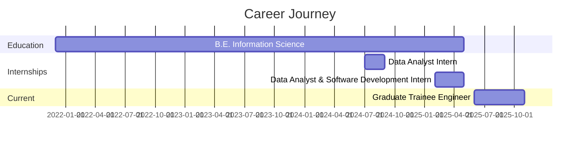
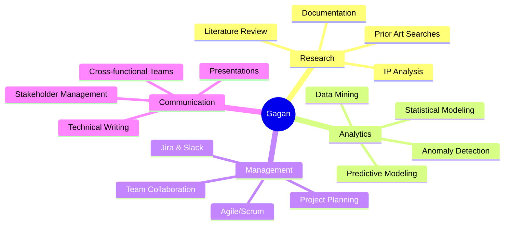

<div style="width: 50%; margin: 0 auto;">
  <h1>🙋‍♂️ Hi, I'm Gagan Biradar</h1> 
</div>
  
[](https://git.io/typing-svg)


</div>

<div align="center">
  <a href="https://darshankrishna-dk.io">
    
  </a>
</div>

## 🚀 About Me

```python
class GET:
    def __init__(self):
        self.name = "Gagan Biradar"
        self.role = "Graduate Trainee Engineer @ Space Energy Systems"
        self.location = "Bengaluru, Karnataka, India 🇮🇳"
        self.education = "B.E. Information Science & Engineering | SDM College"
        self.passion = ["Data Science", "Machine Learning", "Healthcare Research", 
                       "Quantitative Finance", "Business Intelligence"]
        
    def current_focus(self):
        return {
            "learning": ["Big Data Analytics", "Statistical Modeling", "Finincail Modeling and Analysis", "AI/ML"],
            "working_on": ["Application Development", "System Design", "BMS Analytics", "Natural Language Processing", ".NET Development", "ETL Pipelines"],
            "platforms": ["MIT OCW", "MITx", "Coursera"],
            "Achieving to": "Contibute in domain of Technology through data driven decision making, problem solving and Research "
        }
    
    def say_hi(self):
        print("Thanks for stopping by! Let's connect and build something amazing together!")

me = Graduate Engineer Trainee()
me.say_hi()
```

<div align="center">

### 🎯 Quick Highlights

</div>

<table align="center">
<tr>
<td align="center" width="50%">

🔬 **Research Enthusiast**  
Self-directed research in biomedical science, computational biology, and life science technology

</td>
<td align="center" width="50%">

📊 **Data Wizard**  
Analyzing 10,000+ records datasets to drive business impact and efficiency improvements

</td>
</tr>
<tr>
<td align="center" width="50%">

🏆 **Hackathon Champion**  
Vibeathon Finalist (Top 20/1200+), ETHGlobal Singapore, and 15+ hackathons

</td>
<td align="center" width="50%">

🌐 **Software Developer**  
Building scalable applications with React Native, Python, .NET, and cloud technologies

</td>
</tr>
</table>

---

## 💼 Current Role

<table>
<tr>
<td width="60%">

**Graduate Trainee Engineer** @ [Space Energy Systems Pvt Ltd](https://www.spaceenergysystems.com/)  
*February 2025 - Present | Bengaluru, India*

- 🔋 Developing **Battery Management Systems (BMS)** analytics for SoH and SoC estimation
- 🔍 Conducting **IP analysis** and prior art searches for patent development
- 💻 Learning **.NET** for desktop application development and HMI tools
- 🏗️ Building construction operations app with data-driven workflows
- 📈 Processing **10,000+ records** to quantify business impact on battery efficiency
- 🛠️ Utilizing Python, SQL, Excel, and Power BI for comprehensive analysis

</td>
<td width="40%">


</td>
</tr>
</table>

---

## 🛠️ My Tech Stack Arsenal

<div align="center">

<p align="center">
  
</p>

### Languages & Core Technologies


### Data Science & Analytics


### Big Data & Cloud


### Web & Mobile Development


### Tools & Concepts


</div>

---

## 🎯 Featured Projects

<div align="center">

</div>

### 🔗 [LinkSphere](https://github.com/Gagnub/Linksphere) - Professional Networking Platform
> High-performance mobile app connecting professionals worldwide

**Tech Stack:** React Native • PostgreSQL • GraphQL • Apollo Client • StepZen  
**Impact:** Enhanced user engagement with real-time messaging and seamless backend operations

---

### 🔋 Battery Management System Analytics
> Comprehensive analytical framework for real-time battery performance monitoring

**Tech Stack:** Python • SQL • Power BI • Statistical Modeling • Time-Series Analysis  
**Impact:** 
- Processed **500,000+ data points** from multiple BMS units
- Achieved **95% accuracy** in predicting degradation patterns
- Reduced downtime with **48-hour advance** failure detection

---

### 📊 Big Data Analytics for SEO
> Large-scale SEO analytics processing 500,000+ keywords

**Tech Stack:** Apache Spark • Hadoop • Python • Power BI  
**Impact:**
- **78% prediction accuracy** for SERP positions
- **40% improvement** in organic traffic predictions
- Automated competitor analysis tracking **200+ websites**

---

### 🎮 Monte Carlo Simulation for Sports Analytics
> ML-powered prediction models for NBA and NFL games

**Tech Stack:** Python • Statistical Modeling • Financial Modeling • ML Algorithms  
**Impact:** Probabilistic insights and risk analysis for performance prediction

---

### 🗣️ [Voice Vault](https://github.com/Gaganub/VoiceVault) - AI Voice Analysis
> Sentiment and tone analysis for voice recordings

**Tech Stack:** Python • GORQ API • Real-time Audio Processing  
**Recognition:** Built for Bolt's World's Largest Hackathon (128,574 participants)

---

## 🏆 Hackathons & Achievements

<details>
<summary><b>🎖️ Click to view all achievements (15+ hackathons)</b></summary>

<br>

| Event | Achievement | Year | Location |
|-------|-------------|------|----------|
| **Vibeathon** (Replit × Polaris) | 🥈 **Finalist - Top 20/1200+** | 2025 | Bengaluru |
| **ETHGlobal Singapore** | 🌐 Full-stack Supply Chain Solution | 2024 | Singapore |
| **Arbitrum Open House Hack** | 💼 Escrow Freelance Platform | 2025 | Bengaluru |
| **Hack the Track** (Toyota GR) | 📊 Telemetry Analytics Dashboard | 2025 | Online |
| **World's Largest Hackathon** (Bolt) | 🎤 VoiceVault (128,574 participants) | 2025 | Online |
| **ETHSF Hackathon** | 🛒 Web3 Marketplace Platform | 2025 | Online |
| **Codegeist Unleashed** (Atlassian) | 🤖 AI Productivity Tools (1,689 participants) | 2025 | Online |
| **TiDB Future App Hackathon** | 🗄️ Enterprise Analytics Platform | 2023 | Online |
| **MumbaiHacks** | 🏢 CRM Tool for SMBs | 2025 | Online |
| **HexaFalls Hackathon** | 💰 Crypto Portfolio Manager | 2025 | Online |
| **Coinbase Agents in Action** | 🤖 DeFi Agentic AI | 2025 | Online |
| **Warpspeed: Agentic AI Hackathon** | 🚀 AI Workflow Automation | 2025 | Online |
| **Reddit × Kiro: Community Games** | 🎮 Community Engagement Game | 2025 | Online |
| **Octant DeFi Hackathon** | 💎 Crypto Asset Analyzer | 2025 | Online | 

</details>

<div align="center">

</div>

---

## 📚 Research & Publications

<table>
<tr>
<td width="60%">

### 🔬 Undergraduate Research (2022 - Present)

- **Biomedical Science & Computational Biology** via MIT OCW/MITx
- **DNA-based Storage** and molecular computing techniques
- **ML/AI in Drug Discovery** - Protein structure analysis
- **Automated Biomedical Instruments** - PCR diagnostic devices
- **Prior Art Searches & IP Analysis** for patent applications

### 📄 Publications

**"Soul Sync - Connect Through Emotions"**  
*International Journal of Scientific Research in Engineering and Management (IJSREM)*  
Published: May 16, 2025

Coauthored a paper on an innovative offline-first social platform with AI-powered emotion analysis and personalized recommendations.

</td>
<td width="40%">


</td>
</tr>
</table>

---

## 📊 GitHub Analytics

<div align="center">


### 🐍 Contribution Activity

<div align="center">
  
</div>


## 📈 Profile Summary


---

## 🎓 Education & Certifications

<table>
<tr>
<td width="50%">

### 🎓 Education

**B.E. Information Science & Engineering**  
SDM College of Engineering & Technology  
*VTU University | 2021 - 2025*  
CGPA: 7.13/10

**High School (PCMB)**  
Smt. Vidya P Hanchinmani PU College  
*2019 - 2021 | 84%*

</td>
<td width="50%">

### 📜 Key Certifications

- ✅ Application Development & Security (GCP)
- ✅ Google Cloud Artificial Intelligence
- ✅ Information Security (CS406)
- ✅ Python for Data Science (CS250)
- ✅ Cloud Computing Fundamentals
- ✅ System Design Interview Mastery

</td>
</tr>
</table>

---

## 💡 Professional Experience Timeline



---

## 🌟 Skills Matrix - Soft Skills

<div align="center">

<div align="center">

### 💪 Soft Skills



</div>

---

## 🌟 Skills Matrix - Core Competencies

<div align="center">

| Category | Skills |
|----------|--------|
| **Data Science** | Statistical Modeling • Machine Learning • Predictive Analytics • Time-Series Analysis |
| **Big Data** | Apache Spark • Hadoop • ETL Pipelines • Data Warehousing |
| **Analytics Tools** | Python • R • SQL • Power BI • Matplotlib • Pandas • NumPy |
| **Development** | React Native • Flask • .NET • GraphQL • REST APIs |
| **Cloud & DevOps** | AWS • Google Cloud • Docker • Kubernetes • CI/CD |
| **Research** | Literature Review • Prior Art Searches • IP Analysis • Technical Documentation |
| **Project Management** | Agile/Scrum • Jira • Slack • Team Collaboration • Stakeholder Communication |

</div>

---

## 🔥 Current Focus Areas

<table align="center">
<tr>
<td align="center" width="33%">

### 🧠 Learning
- Advanced ML Algorithms
- Deep Learning with TensorFlow
- Quantitative Finance Models
- Healthcare Analytics

</td>
<td align="center" width="33%">

### 🛠️ Building
- BMS Analytics Platform
- .NET Desktop Applications
- Construction Ops App
- ETL Data Pipelines

</td>
<td align="center" width="33%">

### 🎯 Working Towards
- Master Big Data Technologies
- Contributing to Open Source
- Patent and Prior Art Search & Analysis
- Research Publications

</td>
</tr>
</table>

---

 
<p align="middle">

<div align="center">

<a href="https://www.linkedin.com/in/gagan-u-biradar-731353211/">
  
</a>
<a href="mailto:gaganubofficial.21@outlook.com">
  
</a>
<a href="mailto:gubwork.21@gmail.com">
  
</a>
<a href="https://www.quora.com/profile/Gagan-667">
  
</a>
<a href="https://github.com/Gaganub">
  
</a>

<br><br>

</div>

---

<div align="center">

### 💭 Quote


### 💡 "Turning data into insights, insights into impact"

**Open to remote, hybrid, or on-site opportunities | Available for collaborations**


---

⭐️ From [Gaganub](https://github.com/Gaganub) 😀

</div>
